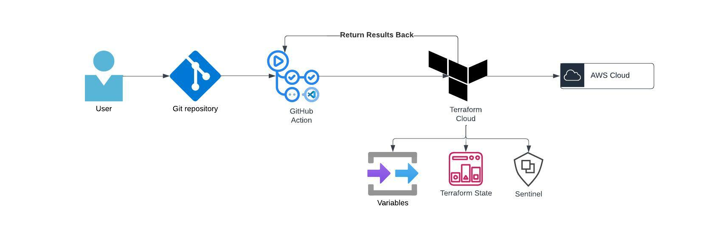
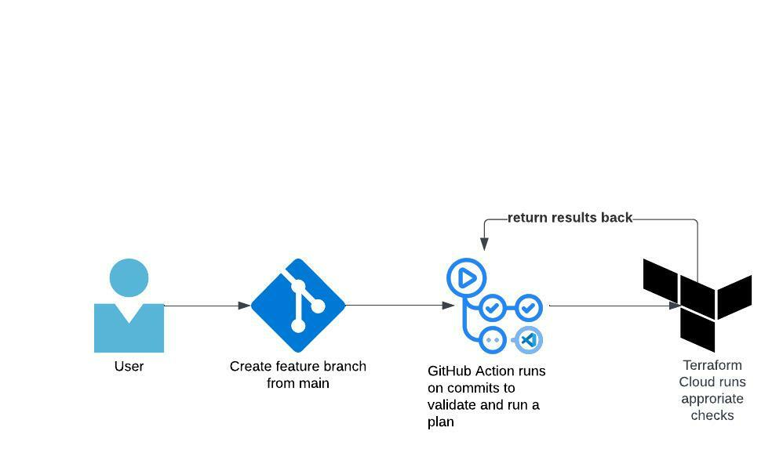
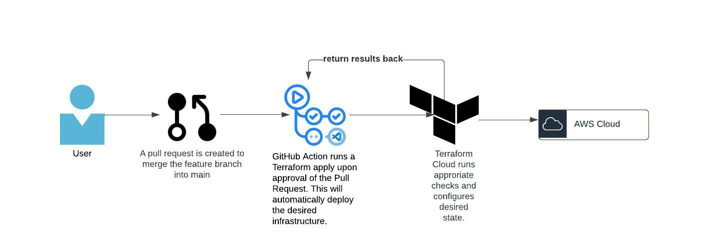

## GitHub Action using Terraform Cloud

GitHub action using Terraform Cloud as the backend.

## High Level Diagram

## Workflow

### Feature Requests

User will create a feature branch and make changes. As they commit to the feature branch GitHub actions will run a terraform validate and plan. The plan will be validated against TFCB.

TFCB will return the results back to GitHub actions.

### Merge into main

Once the user is happy with their feature request they will create a pull request to merge the changes into main.

Upon approval of merge a Terraform apply will be ran to ensure continous development.

